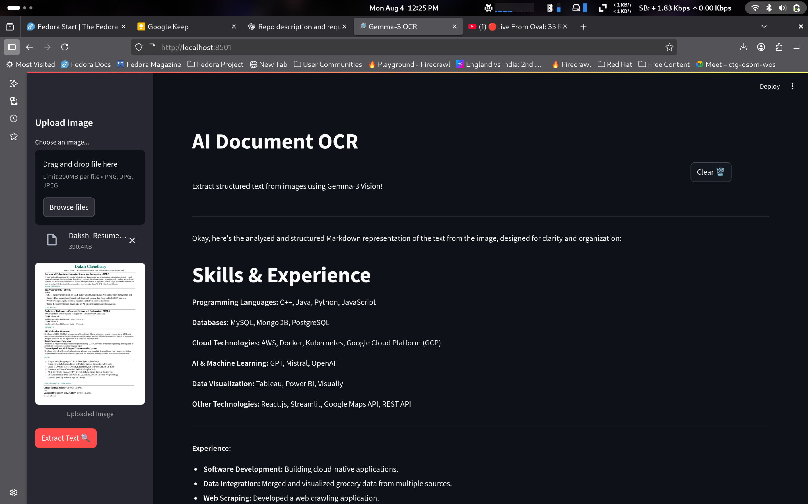

# 🔎 Gemma OCR - AI Document Text Extraction

A powerful and user-friendly Streamlit application that leverages the **Gemma-3 Vision Model** via Ollama to perform Optical Character Recognition (OCR) on uploaded images. Extract structured text from documents, handwritten notes, screenshots, and more with AI-powered accuracy.

## ✨ Features

- **Multi-format Image Support**: Upload PNG, JPG, and JPEG files
- **AI-Powered OCR**: Uses Gemma-3 Vision Model for accurate text extraction
- **Structured Output**: Results formatted in clean, organized Markdown
- **Clean Interface**: Intuitive sidebar-based upload with real-time preview
- **Easy Reset**: One-click clear functionality
- **Fast Processing**: Streamlined workflow for quick results

## 🚀 Getting Started

### Prerequisites

- Python 3.8 or higher
- [Ollama](https://ollama.ai/) installed on your system
- Gemma-3 Vision model pulled in Ollama

### Installation

1. **Clone the repository**
   ```bash
   git clone https://github.com/DakshC17/gemma_ocr.git
   cd gemma_ocr
   ```

2. **Create and activate virtual environment**
   ```bash
   python -m venv myvenv
   source myvenv/bin/activate  # On Windows: myvenv\Scripts\activate
   ```

3. **Install dependencies**
   ```bash
   pip install -r requirements.txt
   ```

4. **Set up Ollama and Gemma-3 Model**
   ```bash
   # Install Ollama (if not already installed)
   curl -fsSL https://ollama.ai/install.sh | sh
   
   # Pull the Gemma-3 Vision model
   ollama pull gemma3:4b
   ```

### Usage

1. **Start the application**
   ```bash
   streamlit run ocr.py
   ```

2. **Open your browser** and navigate to `http://localhost:8501`

3. **Upload an image** using the sidebar file uploader

4. **Click "Extract Text 🔍"** to process the image

5. **View results** in the main content area formatted as Markdown

## 📋 Dependencies

- **streamlit**: Web application framework
- **ollama**: Interface for running Ollama models
- **pillow**: Image processing library
- **PyMuPDF**: PDF processing (for future enhancements)

## Project Structure

```
gemma_ocr/
├── ocr.py              # Main Streamlit application
├── requirements.txt    # Python dependencies
├── README.md          # Project documentation
├── myvenv/            # Virtual environment
└── image_output/      # Sample outputs directory
    └── output.png     # Example output screenshot
```

## 📸 Sample Output




## 🔧 Configuration

The application uses the following default settings:

- **Model**: `gemma3:4b`
- **Supported formats**: PNG, JPG, JPEG
- **Layout**: Wide layout with expanded sidebar
- **Page title**: "Gemma-3 OCR"

To modify these settings, edit the configuration section in `ocr.py`:

```python
st.set_page_config(
   page_title="Gemma-3 OCR",
   page_icon="🔎",
   layout="wide",
   initial_sidebar_state="expanded"
)
```

## Use Cases

- **Document Digitization**: Convert printed documents to editable text
- **Note Taking**: Extract text from handwritten notes or whiteboard photos
- **Receipt Processing**: Digitize receipts and invoices
- **Screenshot Text Extraction**: Pull text from application screenshots
- **Academic Research**: Extract text from research papers and books
- **Language Learning**: Process foreign language documents

## Troubleshooting

### Common Issues

1. **Ollama Connection Error**
   - Ensure Ollama is running: `ollama serve`
   - Verify model is installed: `ollama list`

2. **Model Not Found**
   - Pull the required model: `ollama pull gemma3:4b`

3. **Image Upload Issues**
   - Check file format (PNG, JPG, JPEG only)
   - Ensure file size is reasonable (<10MB)

4. **Slow Processing**
   - Large images may take longer to process
   - Consider resizing images before upload

##  Future Enhancements

- [ ] Support for PDF files
- [ ] Batch processing multiple images
- [ ] Export results to various formats (TXT, DOCX, PDF)
- [ ] OCR confidence scoring
- [ ] Custom prompt templates
- [ ] Multi-language support
- [ ] Image preprocessing options

## 🤝 Contributing

Contributions are welcome! Please feel free to submit a Pull Request. For major changes, please open an issue first to discuss what you would like to change.

## 📄 License

This project is open source and available under the [MIT License](LICENSE).

## 🙏 Acknowledgments

- **Ollama** team for the excellent local AI model runner
- **Google** for the Gemma-3 Vision Model
- **Streamlit** for the amazing web app framework
- **PIL/Pillow** for image processing capabilities

## 📧 Contact

**Daksh Choudhary**
- GitHub: [@DakshC17](https://github.com/DakshC17)
- Project Link: [https://github.com/DakshC17/gemma_ocr](https://github.com/DakshC17/gemma_ocr)

---

